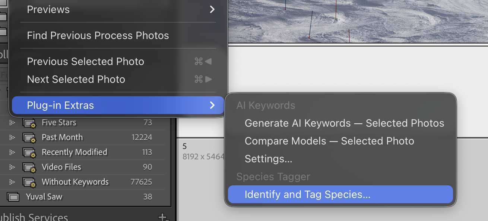

# Species Tagger for Adobe Lightroom Classic

Tag the **plants and animals** in your photos with both the **common name** and the
**Latin (scientific) name** — straight from the Library module in Adobe Lightroom
Classic. You read Google Lens's results and highlight the species; the plugin resolves
your pick through the [GBIF](https://www.gbif.org/) taxonomy and writes canonical
keywords to the photo.

## Download

| | |
|---|---|
| [-blue?style=for-the-badge)](https://github.com/yuvaloren/lightroom-species-tagger/releases/latest/download/SpeciesTagger-mac.pkg) | Apple Silicon **and** Intel — one installer |
| [-blue?style=for-the-badge)](https://github.com/yuvaloren/lightroom-species-tagger/releases/latest/download/SpeciesTagger-win-setup.exe) | Windows 10/11 (incl. ARM via emulation) |

Run the downloaded installer — that's the whole install. No admin password, nothing to
configure, no Plug-in Manager steps. You need **Adobe Lightroom Classic** and **Google
Chrome** installed. (Prefer a manual install? See [[Installing]].)

## Where to find it in Lightroom

> **Select photos in the Library, then choose
> Library ▸ Plug-in Extras ▸ Identify and Tag Species**

## Quick start

1. **Install** with the download above, then start (or restart) Lightroom Classic.
2. **Select photos** in the Library and run **Library ▸ Plug-in Extras ▸ Identify and
   Tag Species**. A Chrome window opens with Google's results for the first photo.
3. **Highlight the species name** in the results (Latin or common — either works) and
   press **Tag** in the bar at the bottom. The keywords are written to the photo, and
   the next photo loads. Press **Skip** to leave one untagged.

More detail in [[Using it]] · settings in [[Settings]] · problems? see
[[Troubleshooting]] and the [[FAQ]].
